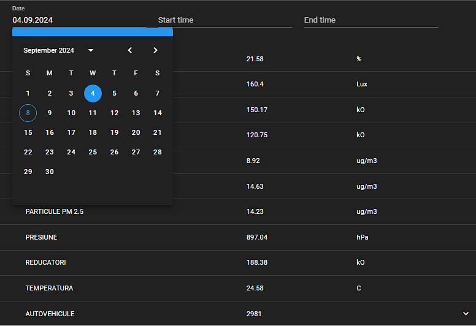
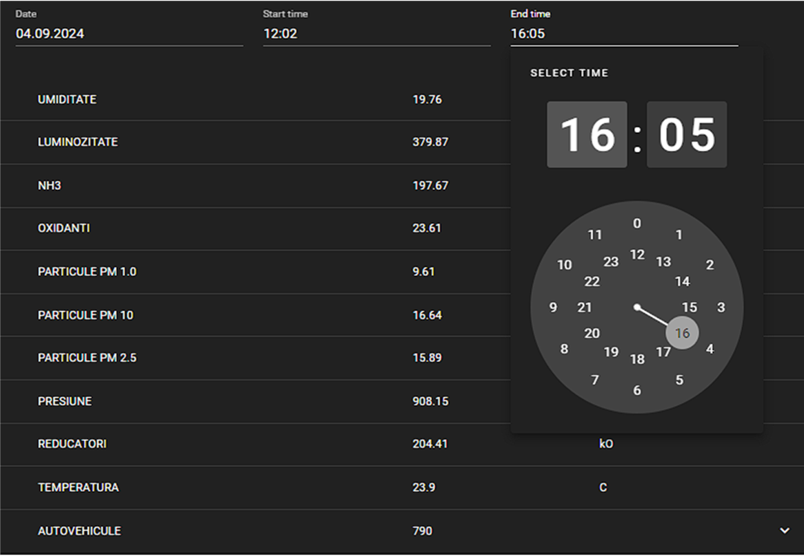
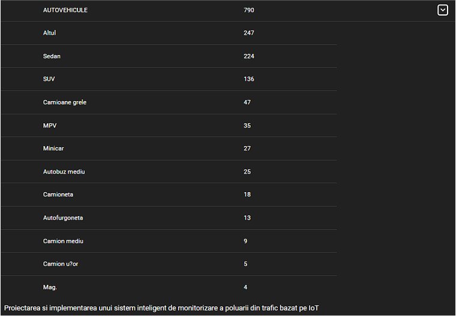

# Raspberypy Project Description

## 📸 Screenshots

## Overview
Raspberypy is a modern web application that showcases the implementation of contemporary web development practices and technologies. The project demonstrates how to build a responsive, user-friendly interface using the latest web development tools and frameworks.

## Key Features
- Modern and intuitive user interface
- Responsive design that adapts to various screen sizes
- Efficient state management implementation
- Clean and maintainable code architecture
- Modern development workflow with hot-reload

## Technical Implementation

### Frontend Framework
- **Vue 3**: Utilized for its composition API and improved performance
- **Vuetify 3**: Implemented for Material Design components and consistent UI
- **Vite**: Used for fast development and optimized builds

### State Management
- **Pinia**: Implemented for efficient state management
- Custom stores for managing application state
- Reactive data handling

### Routing
- **Vue Router**: Implemented for single-page application navigation
- Dynamic route handling
- Nested routes for complex navigation

### Styling
- **SASS**: Used for advanced CSS features
- Custom theme implementation
- Responsive design patterns

### Development Tools
- **ESLint**: Code quality and consistency
- **Vite**: Development server and build optimization
- Hot Module Replacement (HMR)

## Project Structure
The project follows a modular architecture with clear separation of concerns:
- Components are organized by feature
- Reusable components are separated
- State management is centralized
- Routing is modular and maintainable

## Development Workflow
1. Component-based development
2. State management with Pinia
3. Routing with Vue Router
4. Styling with SASS and Vuetify
5. Code quality with ESLint

## Best Practices Implemented
- Component reusability
- Clean code architecture
- Efficient state management
- Responsive design
- Performance optimization
- Code maintainability

## Future Improvements
- Additional feature implementations
- Performance optimizations
- Enhanced user experience
- Extended functionality
- Additional theme options 
